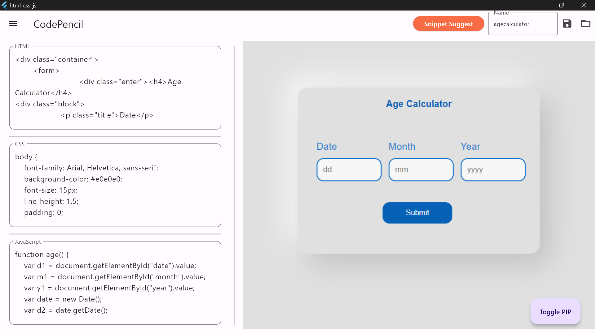
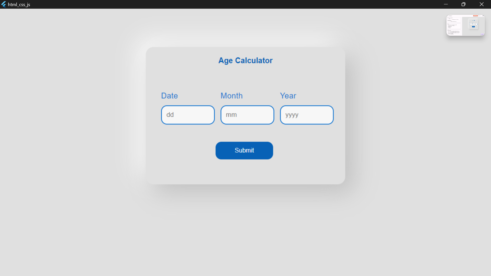

# HCJ Code Compiler

## Overview
HCJ Code Compiler is a powerful desktop application designed to streamline the development and testing of HTML, CSS, and JavaScript code. Inspired by popular online code editors like CodePen, this app allows users to write, compile, and preview web code in real-time, with features tailored for both beginners and experienced developers.

## Key Features
- **Real-Time Code Editor:** Write, compile, and preview HTML, CSS, and JavaScript code instantly with dynamic WebView feedback.
- **Comprehensive File Management:** Save projects with separate HTML, CSS, and JavaScript files, and easily open and edit existing projects.

## Screenshots

### Real-Time Code Editor

### Live Preview

